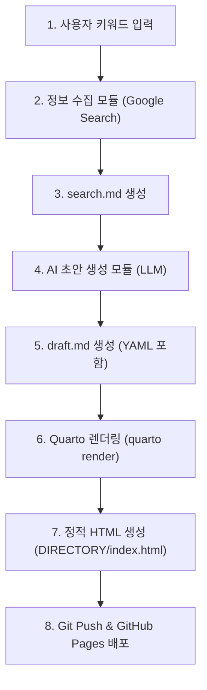

# Product Requirement Document (PRD) - Automated Blog System (자동 블로그 시스템)

## 1. 프로젝트 개요 (Overview)
본 프로젝트는 특정 키워드를 기반으로 **최신 자료 수집 -> AI 블로그 글 초안 작성 -> Quarto 정적 사이트 빌드 -> GitHub Pages 배포**에 이르는 전 과정을 자동화하는 시스템을 구축하는 것을 목표로 합니다.

사용자는 매번 자료를 조사하고 작성하는 번거로움 없이, 키워드 입력만으로 양질의 최신 정보가 담긴 블로그 포스트를 자동으로 발행할 수 있습니다.

---

## 2. 주요 기능 및 요구사항 (Key Features & Requirements)

### 2.1. 키워드 기반 정보 수집 (Information Gathering)
- **목표**: 사용자가 지정한 키워드를 웹에서 검색하여 최신 정보를 수집합니다.
- **세부 요구사항**:
  - 구글 검색 API(Google Custom Search) 또는 스크래핑 라이브러리를 활용하여 입력 키워드와 관련된 상위 검색 결과의 제목, 링크, 요약(Snippet) 또는 본문 텍스트를 수집합니다.
  - 수집된 원천 자료는 구조화된 형식으로 `search.md` 파일에 기록합니다.
  - **출력 파일**: `search.md` (검색어, 검색 시간, 참고 사이트 목록, 핵심 내용 요약 포함)

### 2.2. AI 기반 블로그 포스트 초안 작성 (AI Drafting)
- **목표**: `search.md`에 수집된 정보를 바탕으로 독자 지향적이며 자연스러운 한국어 블로그 글을 생성합니다.
- **세부 요구사항**:
  - LLM(Gemini API 등)을 호출하여 수집된 정보를 바탕으로 심층 분석 포스트를 작성합니다.
  - 검색 엔진 최적화(SEO) 규칙을 준수합니다 (H2, H3 태그의 적절한 사용, 키워드 배치 등).
  - Quarto 블로그 포스트에 필수적인 YAML 프론트매터(Front Matter)를 자동으로 생성하여 포함시킵니다 (제목, 날짜, 태그, 카테고리 등).
  - **출력 파일**: `draft.md` (Quarto 호환 마크다운 양식)

### 2.3. Quarto 정적 빌드 및 GitHub Pages 배포 (Build & Deploy)
- **목표**: 작성된 초안(`draft.md`)을 Quarto 블로그 웹사이트 형태로 변환하고 실제 웹에 배포합니다.
- **세부 요구사항**:
  - 생성된 `draft.md`를 Quarto 블로그 프로젝트의 포스트 디렉토리로 이동시킵니다.
  - `quarto render` 명령을 수행하여 마크다운 초안을 HTML 파일(`DIRECTORY/index.html`)로 변환합니다.
  - 변경된 정적 리소스를 Git을 통해 GitHub Pages 레포지토리에 커밋 & 푸시하여 실시간으로 배포를 완료합니다.

---

## 3. 시스템 아키텍처 및 데이터 흐름 (Architecture & Data Flow)



---

## 4. 기술 스택 (Tech Stack)

| 구분 | 기술명 | 비고 |
| :--- | :--- | :--- |
| **개발 언어** | Python 3.10+ | 스크래핑 및 LLM API 연동의 높은 라이브러리 지원율 |
| **정보 수집** | `requests`, `BeautifulSoup4` or Google Custom Search API | 웹 데이터 크롤링 및 파싱 |
| **AI 생성** | Gemini API (`google-genai` 또는 `google-generativeai`) | 최신 AI 엔진을 활용한 초안 작성 |
| **정적 사이트 빌드** | Quarto CLI | 마크다운 기반 정적 블로그 빌드 도구 |
| **버전 관리 및 배포**| Git, GitHub Pages | 완성된 정적 파일 호스팅 및 배포 자동화 |

---

## 5. 예상 디렉토리 구조 (Directory Structure)

```text
Blog_AI/
├── PRD.md               # 본 제품 요구사항 정의서
├── config.yaml          # 키워드, API 키, 블로그 설정 정보
├── main.py              # 전체 자동화 프로세스 실행 진입점 (orchestrator)
├── src/
│   ├── collector.py     # 정보 수집 (search.md 생성)
│   ├── writer.py        # AI 초안 작성 (draft.md 생성)
│   └── deployer.py      # Quarto 렌더링 및 Git 배포
├── search.md            # 수집된 정보 저장 파일
├── draft.md             # AI가 생성한 포스트 초안 파일
└── blog/                # Quarto 블로그 프로젝트 폴더
    ├── _quarto.yml      # Quarto 전체 설정 파일
    ├── index.qmd        # 블로그 메인 페이지
    └── posts/           # 블로그 포스트들이 저장되는 폴더
        └── [post-dir]/
            └── index.html # 최종 빌드된 포스트 HTML
```

---

## 6. 마일스톤 및 향후 과제 (Milestones & Next Steps)

1. **Phase 1: PRD 합의 및 개발 환경 셋업** (현재 단계)
   - PRD 정의서 작성 및 요구사항 확정
   - Quarto 블로그 템플릿 기본 구성 및 로컬 렌더링 확인
2. **Phase 2: 정보 수집 & LLM 작성 모듈 구현**
   - 구글 검색 스크래퍼 또는 API 연동 구현 -> `search.md` 생성 검증
   - Gemini API를 통한 SEO 최적화 글 쓰기 프롬프트 튜닝 -> `draft.md` 생성 검증
3. **Phase 3: Quarto 연동 및 배포 자동화 구현**
   - `quarto render` 자동 실행 셸 스크립트/파이썬 코드 구현
   - Git CLI 연동 또는 GitHub Actions를 활용한 자동 커밋/푸시 구현
4. **Phase 4: 전체 흐름 통합 테스트 및 스케줄러 등록**
   - 주기적 자동 포스팅을 위한 Cron 설정 또는 GitHub Actions Workflow 작성
