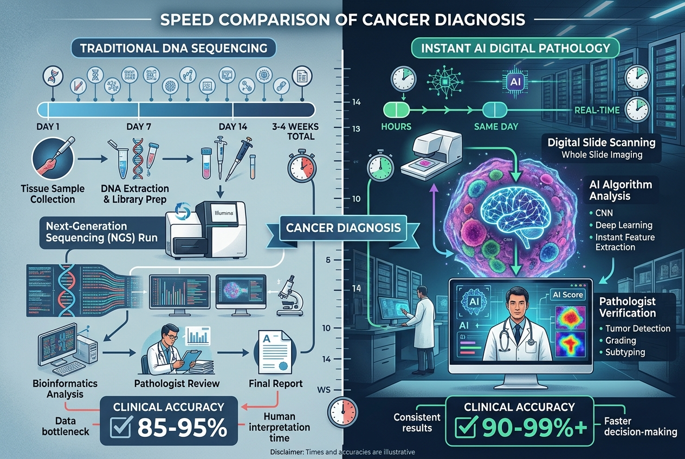
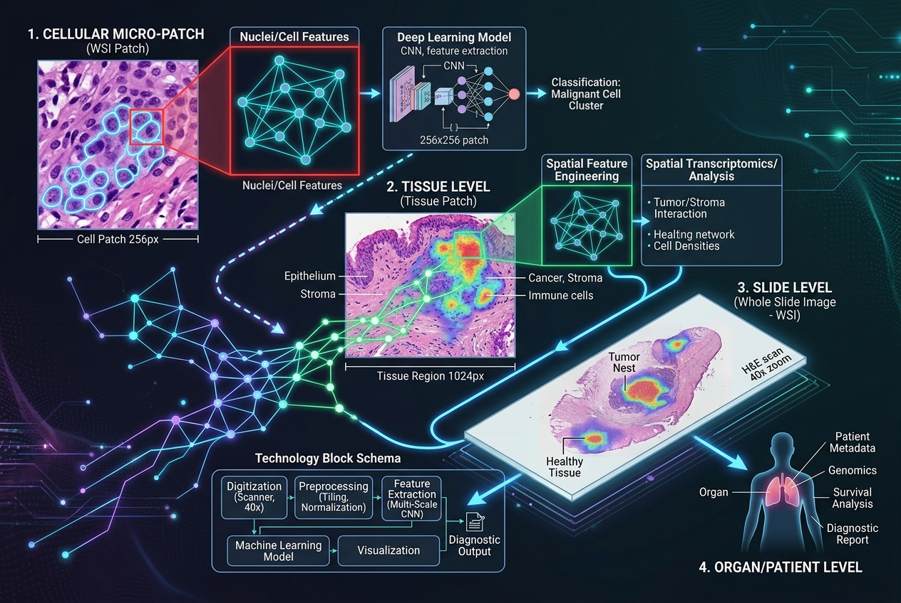

## 1. 도입: 암 진단을 위한 피 마르는 2주의 기다림, 1분으로 줄일 수 있다면?

암 진단을 받은 환자와 가족들에게 가장 고통스러운 시간 중 하나는 바로 '기다림'입니다. 어떤 항암제가 맞을지, 어떤 유전자 변이가 있는지 알아내기 위한 정밀 유전자 검사(NGS 등)는 보통 결과가 나오기까지 최소 2주에서 길게는 한 달까지 소요되기도 합니다. 그사이 암 세포는 자라나고, 환자의 불안감은 극에 달합니다. 

그런데 **\"단 1분 만에 조직 이미지 분석을 통해 유전자 변이를 정확히 예측할 수 있다면 어떨까요?\"** 

LG AI연구원이 개발한 의료 특화 AI 모델 **'엑사원 패스(EXAONE Path)'**가 바로 이 질문에 대한 해답을 제시하고 있습니다. 기존의 의료 패러다임을 바꿀 엑사원 패스는 어떻게 2주의 시간을 1분으로 단축시킬 수 있었을까요?

---

## 2. 핵심 요약: 엑사원 패스(EXAONE Path)의 3가지 핵심 강점

### ① 검사 시간의 혁신적 단축 (2주 → 1분 이내)
기존에는 환자의 암 조직을 떼어내어 복잡한 유전자 분석(NGS) 장비를 거쳐야만 유전자 변이 여부를 알 수 있었습니다. 하지만 엑사원 패스는 생검 조직을 스캔한 **병리 조직 이미지(Whole Slide Image, WSI)**를 입력받아 AI가 시각 정보를 분석함으로써 1분 이내에 유전자 변이를 찾아냅니다.

### ② 세계 최고 수준(SOTA)의 진단 및 예측 정확도
단순히 속도만 빠른 것이 아닙니다. 엑사원 패스는 최신 버전(2.0) 기준으로 하버드대, 마이크로소프트 등 글로벌 빅테크 및 연구기관들이 내놓은 의료 AI 모델들과의 벤치마크 테스트에서 우수한 성적을 거두며 **세계 최고 수준(SOTA, State-of-the-Art)**의 예측 정확도를 입증했습니다.

### ③ 유기적인 스케일 분석 및 멀티오믹스 연계
의료 이미지 분석의 고질적 난제인 **'특징 붕괴(Feature Collapse)'**를 해결했습니다. 세포 수준의 미세한 패치 단위부터 전체 장기 크기의 슬라이드 수준까지 정보를 손실 없이 종합 학습하는 기술을 보유하고 있으며, 유전체 데이터(멀티오믹스)와의 융합 분석을 수행합니다.

---

## 3. 상세 설명: 엑사원 패스가 이끄는 의료 AI 혁신의 깊이

### ■ 왜 '1분 예측'이 가능하며, 이것이 왜 중요할까요?
전형적인 유전자 검사는 고가의 장비와 복잡한 전처리 과정이 필요하며, 검사 비용도 수백만 원에 달합니다. 반면 병리 조직 슬라이드는 암 진단을 위해 기본적으로 제작하는 단계입니다. 엑사원 패스는 이미 제작된 디지털 병리 이미지를 소프트웨어로 분석하기 때문에 별도의 추가 유전자 분석 비용이나 대기 시간 없이, 의사가 모니터를 통해 조직을 확인하는 즉시 예상되는 유전자 변이 정보를 추천해 줄 수 있습니다. 이는 조기 진단율을 획기적으로 끌어올려 치료 골든타임을 확보하는 데 결정적인 기여를 합니다.

### ■ 기술적 차별점: 특징 붕괴 극복과 초고해상도 학습
병리 조직 이미지는 단 한 장의 용량이 수 기가바이트(GB)에 달하는 초고해상도 이미지입니다. 이를 AI가 학습하기 위해서는 잘게 쪼갠 '패치(Patch)' 단위로 학습해야 하는데, 이 과정에서 전체 조직의 구조적인 맥락 정보가 사라지는 '특징 붕괴' 현상이 발생하곤 했습니다. 

LG AI연구원은 세포 수준의 미세 패턴과 전체 슬라이드의 거시적 형태를 결합하는 독자적인 인코더 기술을 통해 정보를 보존하는 데 성공했습니다. 이를 통해 암세포 주변의 미세환경까지 완벽하게 파악하여 유전자 변이 예측력을 강화했습니다.

### ■ 맞춤형 항암 치료와 글로벌 실증 협력
엑사원 패스는 단순히 암의 유무를 진단하는 데 그치지 않고, 특정 표적 항암제나 면역 항암제에 환자가 어떻게 반응할지(예후 예측)까지 모델링합니다. 현재 LG AI연구원은 미국 밴더빌트대 메디컬 센터(VUMC) 등 글로벌 최고 수준의 암 전문 연구소들과 실증 연구를 수행하며 임상 적합성을 확인하고 있으며, 글로벌 의료 AI 탑재 생태계(예: NVIDIA MONAI 등)와 긴밀히 연계되어 전 세계 의료진에게 전달되고 있습니다.

---

## 4. 마무리: 정밀 의료와 신약 개발의 게임 체인저로의 비상
LG AI연구원의 엑사원 패스는 의료 AI가 단순히 의사의 보조 도구를 넘어, 환자 한 사람 한 사람을 위한 맞춤형 정밀 치료의 나침반 역할을 할 수 있음을 보여줍니다. 

앞으로 엑사원 패스가 탑재된 진단 플랫폼이 널리 보급된다면 중소형 병원에서도 대형 대학병원 수준의 고차원 정밀 진단이 가능해질 것이며, 신약 임상시험 단계에서 특정 후보물질에 잘 반응하는 환자군을 선별하는 데 활용되어 신약 개발 비용과 기간을 대폭 감소시킬 것입니다. 의료 불균형 해소와 헬스케어 패러다임 전환의 중심에 설 엑사원 패스의 행보가 기대됩니다.

---

## 5. 참고 자료
- [LG AI연구원 공식 웹사이트](https://www.lgresearch.ai)
- [LG 그룹 뉴스룸](https://www.lg.co.kr)
- [메디게이트 뉴스 - 엑사원 패스 2.0 및 의료 AI 성과](https://www.medigatenews.com)
- [동아일보 IT/과학 기사 - 1분 암 변이 진단 엑사원 패스](https://www.donga.com)
